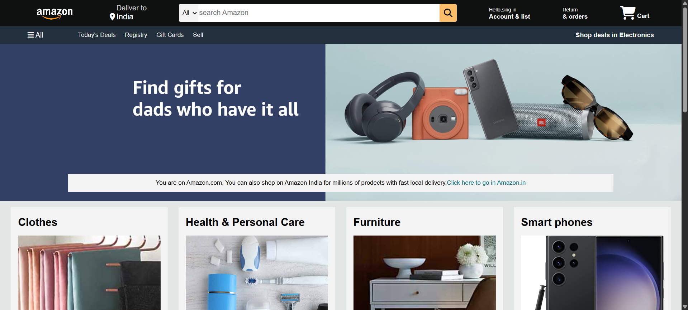

# 🛒 Amazon Clone

A responsive clone of the Amazon India homepage built using **HTML** and **CSS**.  
This project focuses on recreating the layout and styling of a real-world eCommerce site to strengthen front-end skills.

---

## 🔗 Live Demo

👉 [View Live Site](https://hemanth-361.github.io/Amazon-clone/)

---

## 🖼️ Preview

 <!-- Optional: Replace with your own screenshot -->

---

## 📁 Folder Structure

Amazon-clone/ ├── index.html # Homepage structure 
              ├── style.css # Page styling 
              └── assets/ 
                    ├── logo.png # Amazon logo 
                    ├── banner.jpg # Hero banner 
                    ├── product-images/ # Product thumbnails 
                    └── screenshot.png # UI preview (optional)
